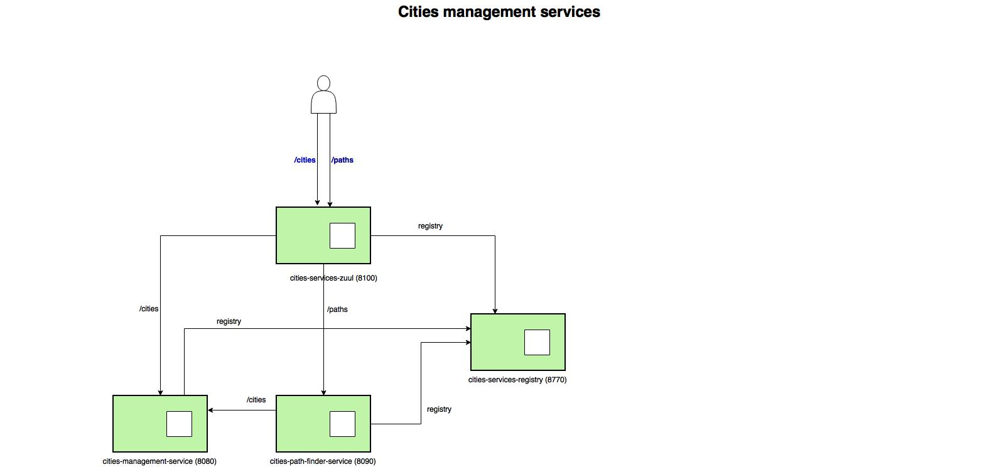

# Cities path finder service

Service that given an origin city will return a list of itineraries, one based in the less number of connections and the second based in the less time. For that purpose two microservices have been created:

* cities-management-service
* cities-path-finder-service

To allow a unique entry point for the api running in both microservicies and provide a service registry for the microservices, these two microservices have been created:

* cities-services-registry
* cities-services-zuul



## cities-management-service

This is a microservice to perform CRUD (create/read/update/delete) operations for city routes. It allows the creation, update, read and deletion of city routes and it stores it in a running memory database. It's running in port 8080

**API documentation** is swagger format [cities-management-service](swagger-cities-management-service.yaml)

## cities-path-finder-service

This is a microservice to find all the routes from a city to all possible destinations based in a list of routes previously introduced with the cities-management-service.
This microservice gets the information from cities-management-service in order to calculate the requested destinations.
To find the shortest path in connections and time, the service creates a directed weighted multigraph representing all the cities and connections and then runs the [Dijkstra algorithm](https://en.wikipedia.org/wiki/Dijkstra%27s_algorithm) for the graph. It's running in port 8090

**API documentation** is swagger format [cities-path-finder-service](swagger-cities-path-finder-service.yaml)

## cities-services-registry

This is a microservice running a netflix eureka server, microservices are registering in this server so requests for the registered microservices are routed to the right running instance. It's running in port 8770

## cities-services-zuul

This is a microservice running a zuul reverse proxy, it provides a unique entry point for all the microservices. It's running in port 8100.


## Getting Started

These instructions will get you a copy of the project up and running on your local machine.

## Prerequisites

[Maven](http://maven.apache.org), [git](https://github.com), [docker](https://www.docker.com), [docker-compose](https://www.docker.com) need to be installed before running any installation.
Git to get all the code locally.
Maven to compile and perform the packaging.
Docker-compose to run every microservice in its own container.


## Build

A step by step series of examples that tell you have to get the application up and running

Clone the git repository locally

```
git clone https://github.com/sergeivgit/challenge-cloud.git
```

Go to the repo directory

```
cd challenge-cloud
```

Go to the build directory

```
cd cities-services-compose
```

Run the build process

```
mvn clean install
```

If everything goes ok you get something like this output


```
[INFO] ------------------------------------------------------------------------
[INFO] Building cities-services-compose 1.0.0.RELEASE
[INFO] ------------------------------------------------------------------------
[INFO] 
[INFO] --- maven-clean-plugin:2.5:clean (default-clean) @ cities-services-compose ---
[INFO] 
[INFO] --- maven-install-plugin:2.4:install (default-install) @ cities-services-compose ---
[INFO] Installing /Users/admin/Documents/workspace-sts-code-challenge/cities-services-compose/pom.xml to /Users/admin/.m2/repository/com/demo/cities/cities-services-compose/1.0.0.RELEASE/cities-services-compose-1.0.0.RELEASE.pom
[INFO] ------------------------------------------------------------------------
[INFO] Reactor Summary:
[INFO] 
[INFO] Cities Common project .............................. SUCCESS [  4.123 s]
[INFO] cities-path-calculation ............................ SUCCESS [  1.010 s]
[INFO] cities-services-registry ........................... SUCCESS [ 33.296 s]
[INFO] cities-services-zuul ............................... SUCCESS [ 27.684 s]
[INFO] cities-management-service .......................... SUCCESS [ 47.043 s]
[INFO] cities-path-finder-service ......................... SUCCESS [ 37.304 s]
[INFO] cities-services-compose ............................ SUCCESS [  0.007 s]
[INFO] ------------------------------------------------------------------------
[INFO] BUILD SUCCESS
[INFO] ------------------------------------------------------------------------
[INFO] Total time: 02:31 min
[INFO] Finished at: 2018-02-04T21:56:29+01:00
[INFO] Final Memory: 74M/388M
[INFO] ------------------------------------------------------------------------

```


## Running the application

In order to get the microservices up and running in their docker containers, run the following docker-compose command in the same directory mvn command was run.

```
docker-compose up --build
```

This command will create two images and will run the containers. One container will run the cities-management-service microservice and the other container will run the cities-path-finder-service microservice.

To check if microservices are properly running, run the following commands if **curl** command available:

```
curl http://localhost:8080/health
```

you might get the following output:

```
{"status":"UP"}
```
the cities-management-service is up and running

Check now cities-path-finder-service

```
curl http://localhost:8090/health
```

you might get the following output:

```
{"status":"UP"}
```
the cities-path-finder-service is up and running. **Congratulations!!**

If you haven't **curl** installed, please intall a tool like [Postman](https://chrome.google.com/webstore/detail/postman/fhbjgbiflinjbdggehcddcbncdddomop) for chrome in order to make a the requests to http://localhost:8100.


## Frameworks/libraries used

* [JGrapht](https://github.com/jgrapht/jgrapht) - JGraphT is a free Java class library that provides mathematical graph-theory objects and algorithms. It runs on Java 2 Platform (requires JDK 1.8 or later starting with JGraphT 1.0.0).
* [Spring boot](https://projects.spring.io/spring-boot/) Used to implement both microservices.
* [Spring Data JPA](https://spring.io/guides/gs/accessing-data-jpa/) Used to store and retrieve data in a database. It has been selected because it's easy to use and integrate.
* [spring-cloud-netflix-eureka](https://projects.spring.io/spring-cloud/) Eureka is the Netflix Service Discovery Server and Client. This project is using an eureka server and the rest of the client services are registering in the server.
* [spring-cloud-netflix-zuul](https://projects.spring.io/spring-cloud/) Library that provides dynamic routing, monitoring, resiliency, security, and more. This project is using a zuul server used as a reverse proxy.
* [H2 in memory data base](http://www.h2database.com/html/main.html) Database used to store city routes date. Very easy to integrate with spring boot and JPA.
* [junit](http://junit.org/junit4/) For unit testing.


## Authors

* **Sergio Ocon** - *Initial work* - 


